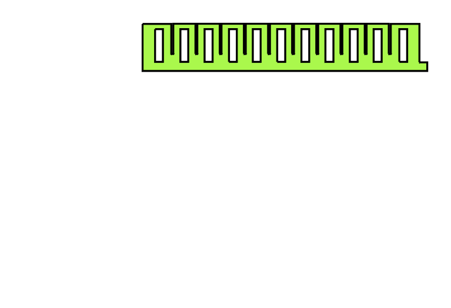
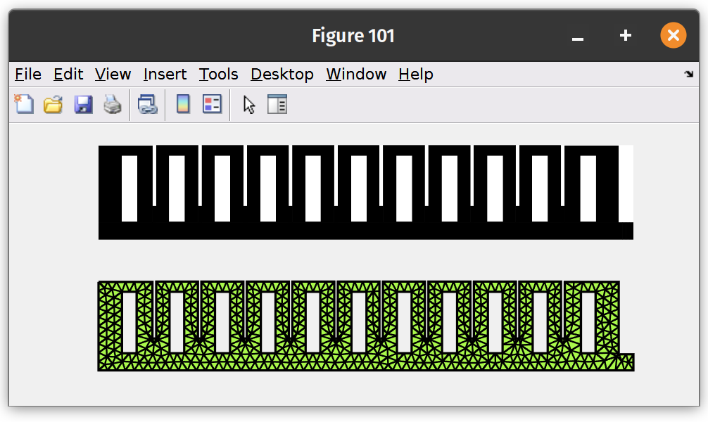

<script>
MathJax = {
  tex: {
    inlineMath: [['$', '$'], ['\\(', '\\)']]
  },
  svg: {
    fontCache: 'global'
  }
};
</script>
<script type="text/javascript" id="MathJax-script" async
  src="https://cdn.jsdelivr.net/npm/mathjax@3/es5/tex-svg.js">
</script>

#  Finite element analysis of PneuNet
{: .no_toc }

<details open markdown="block">
  <summary>
    Table of contents
  </summary>
  {: .text-delta }
1. TOC
{:toc}
</details>
---

#### Difficulty: `easy`{: .fs-3 .text-green-200}
{: .no_toc }
 - Required classes: `Mesh.m`{: .text-purple-000}, `Fem.m`{: .text-purple-000}
 - Code length: `~25 lines`{: .text-purple-000} (without comments)

---
### Introduction
In this illustrative example, we will perform a simple simulation of the classic PneuNet actuator, which is a rectangular-shaped soft robot with embedded pressure chambers. Due to a geometrically-induced stiffness gradient, the soft actuator undergoes bending naturally when pressurized. SOROTOKI is purposefully developed to easily build and simulate various Finite Element models using a minimal programming interface. 

<div align="center">  </div>
<div align="center"> Produced numerical result of the PneuNet actuators using SOROTOKI . </div>

### Generating the mesh from binary image
Lets start generating a planar mesh of the PneuNet actuator. Instead of using the SDF functions as in the previous example, we instead use `.png`{: .text-purple-000} or `.jpg`{: .text-purple-000} files. Located under folder `data\contours`{: .text-purple-000} , we find an image called `PneuNet.png`{: .text-purple-000}  which we can directly input into the mesh generator `Mesh.m`{: .text-purple-000}. We also need to specify a Bounding Box `BdBox`{: .text-purple-000} which tells the mesher the dimension of the image. Lastly, we can tune the mesh quality using `Hmesh = [GrowH,MinH,MaxH]`{: .text-purple-000}, where `GrowH`{: .text-purple-000} is the mesh growth (default is set as `1.0`{: .text-purple-000}), and `MinH`{: .text-purple-000} and `MaxH`{: .text-purple-000} the minimum and maximum element size.

```matlab
% mesh generation settings
Simp  = 0.02;   % simplfication tolerance
GrowH = 1;      % growth
MinH  = 2;      % minimum size
MaxH  = 3;      % maximum size

% generate mesh from .png
msh = Mesh('Pneunet.png','BdBox',[0,120,0,20],'SimplifyTol',Simp,...
    'Hmesh',[GrowH,MinH,MaxH]);
msh = msh.generate();

% show mesh
figure(101);
subplot(2,1,1); imshow('Pneunet.png');
subplot(2,1,2); msh.show();
```
The code above should produce the following:

<div align="center">  </div>
<div align="center"> Source image of Pneunet cross-section (top). Triangular mesh (right). </div>

**Important!** To use images for meshing, you have ensure that the images have a white background and a dark foreground which indicates the region to be meshed.

### Building the finite element model
We can now convert this discretized mesh to a finite element models. We input the `msh`{: .text-purple-000} object generated by the class `Mesh.m`{: .text-purple-000} into `Fem.m`{: .text-purple-000} using:

```matlab
%% generate fem model
fem = Fem(msh,'TimeStep',1/120,'Linestyle','none');
```

### Assigning boundary conditions
Now the tricky part is assigning the boundary conditions -- especially for the pneumatic regions. Luckily, Sorotoki is equipped with easy mesh identifiers using `fem.FindNodes`{: .text-purple-000} or `fem.FindEdges`{: .text-purple-000} that produce the Node or Edge index given certain geometrical features of the mesh. In this case, we want all the enclosed surfaces inside the mesh domain. By calling `id = fem.FindEdges('Hole')`{: .text-purple-000}, we retrieve a list of edges that span all the enclosed volumes. Alternatively, we can use `id = fem.FindEdges('Hole',[1,3...,N])`{: .text-purple-000} where `[1,3...,N]`{: .text-purple-000} is a list of desired holes. Lastly, we can use the input to `fem.addPressure(id,P0)`{: .text-purple-000} to add the pressure load of magnitude `P0 = 25 kPa`{: .text-purple-000} .

```matlab
% pressure load
P0 = 25*kpa;

% motion constraint
id = fem.FindNodes('Left');
fem = fem.addSupport(id,[1,1]);

% pressure load on Mesh
id = fem.FindEdges('Hole');
fem = fem.addPressure(id,P0);
```

**Important!** The standard SI units for SOROTOKI are set to millimeters. As such, all physical features like size, density, pressures, stress, gravitational accelerations, must be scaled accordingly! Therefore, a pressure load of 25 kPa equals `P0 = 25*1e-3`{: .text-purple-000}  MPa (megapascal).


### Material assignment
Next, we assign the material properties to the PneuNet actuator. Here we use the popular silicone DragonSkin 10 from SmoothOn. Sorotoki comes equiped with various common silicone types used extensively in soft robotics, which can be found under `src/fem/material/samples`. To assign the material, consider the following code:

```matlab
%% assign material
fem.Material =  Dragonskin10();
```

### Running the (quasi-static) simulation
To simulate the pneumatic soft robot subjected to a pressure load $P_0 = 25\, \text{kPa}$, together with the assigned boundary loads, we can write:

```matlab
%% assign material
fem.solve();
```

The solver will display the assigned material, the Degrees-of-Freedom, element types, ect. It will also show the progress of the simulation. 

**Note:** The duration of the quasi-static simulation is $T = 1$ standard, implying the loads will monotonically increase for the time domain $[0,T]$. Users may change the horizon time $T$ using the parameter `Fem.TimeEnd` but all external forces will be scaled using a tunable sigmoid function: $f_k(t) = \frac{t - kt}{k - 2k\lvert t \rvert + 1}$ with $k = 0$ (default) -- linear ramp.

### Making the animation
All numerical data from the Fem simulation is saved in a data struct-file under `Fem.Log`{: .text-purple-000}. We're particularly interested in `Fem.Log.Node`{: .text-purple-000} and `Fem.Log.Stress`{: .text-purple-000}, which gives the nodal positions of `Fem.Mesh`{: .text-purple-000} and the Von Mises stresses at the nodal positions, respectively. To make the animation as seen above, we use the following commands:

```matlab
figure(105);
t = fem.Log.t;

% loop of simulation data with FPS = 60
for ii = 1:fps(t,60):numel(t)
    fem.set('Node',fem.Log.Node{ii});
    fem.show('Field',fem.Log.Stress{ii});
    axis([-60 130 -100 30]);   
    background();
    drawnow();
end
```

---
## Complete code (~25 lines without comments)
```matlab
%% simulation settings
P = 15*kpa;   % pressure load in MPa
W = 120;      % width image in mm 
H = 20;       % height image in mm

%% finite element settings
Simp  = 0.02; % simplification tolerance boundary image
GrowH = 1;    % mesh growth
MinH  = 1;    % minimum element size
MaxH  = 2;    % maximum element size

%% generate mesh
msh = Mesh('Pneunet.png','BdBox',[0,W,0,H],...
    'SimplifyTol',Simp,'Hmesh',[GrowH,MinH,MaxH]);
msh = msh.generate();

subplot(2,1,1); imshow('Pneunet.png');
subplot(2,1,2); msh.show();

%% generate fem model
fem = Fem(msh,'TimeStep',1/120,'Linestyle','none');

%% add boundary constraint
fem = fem.addSupport(fem.FindNodes('Left'),[1,1]);
fem = fem.addPressure(fem.FindEdges('Hole'),20*kpa);

%% assign material
fem.Material = Dragonskin10();

%% solve
fem.solve();

%% animation
t = fem.Log.t;
% loop over simulation data with FPS = 60
for ii = 1:fps(t,60):numel(t)
    fem.set('Node',fem.Log.Node{ii});
    fem.show('Field',fem.Log.Stress{ii});
    axis([-60 130 -100 30]);   
    background();
    drawnow();
end
```

[**[1]**](https://www.rubbernews.com/blogs/new-products-james-heal-makes-move-rubber-testing-markets) **Titan10** a pull-test instrument for rubber and elastomers.
{: .fs-3}
