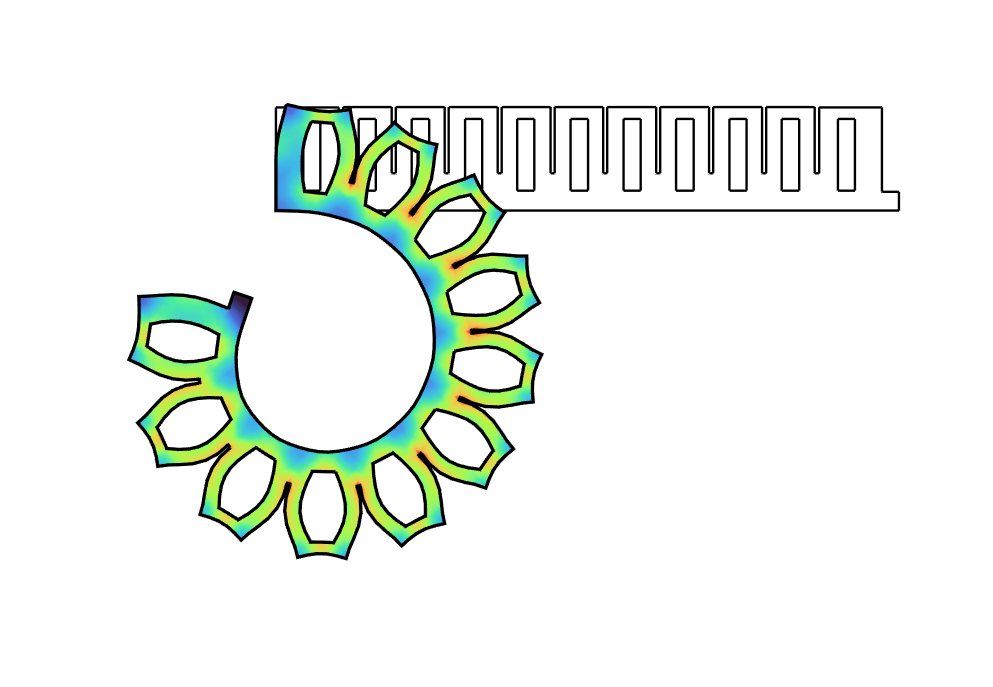

#  Finite element analysis of PneuNet
{: .no_toc }

<details open markdown="block">
  <summary>
    Table of contents
  </summary>
  {: .text-delta }
1. TOC
{:toc}
</details>
---

#### Difficulty: `easy`{: .fs-3 .text-green-200}
{: .no_toc }
 - Required classes: `Mesh.m`{: .text-purple-000}, `Fem.m`{: .text-purple-000}
 - Code length: `~35 lines`{: .text-purple-000} (without comments)

---

### Introduction
In this illustrative example, we will perform a simple pull test using a hyper-elastic material -- Ecoflex-0030 from SmoothOn. Assuming a two-dimensional problem, we consider a 20x20 specimen and perform an uni-axial elongation of $\lambda_{1} = 500\%$ (with $\lambda_2 = \lambda_3$). We model this using a single quadrilateral finite-element subjected to plane-stress conditions.

<div align="center">  </div>
<div align="center"> Stock image of uni-axial test (left, see [1]). Produced result from SOROTOKI (right). </div>

### Generating the mesh from binary image
Lets start generating a planar mesh of the PneuNet actuator. Instead of using the SDF functions as in the previous example, we instead use `.png`{: .text-purple-000} or `.jpg`{: .text-purple-000} files. Located under folder `data\contours`{: .text-purple-000} , we find an image called `PneuNet.png`{: .text-purple-000}  which we can directly input into the mesh generator `Mesh.m`{: .text-purple-000}. We also need to specify a Bounding Box `BdBox`{: .text-purple-000} which tells the mesher the dimension of the image. Lastly, we can tune the mesh quality using `Hmesh = [GrowH,MinH,MaxH]`{: .text-purple-000}, where `GrowH`{: .text-purple-000} is the mesh growth (default is set as `1.0`{: .text-purple-000}), and `MinH`{: .text-purple-000} and `MaxH`{: .text-purple-000} the minimum and maximum element size.

```matlab
% mesh generation settings
Simp  = 0.02;   % simplfication tolerance
GrowH = 1;      % growth
MinH  = 2;      % minimum size
MaxH  = 3;      % maximum size

% generate mesh from .png
msh = Mesh('Pneunet.png','BdBox',[0,120,0,20],'SimplifyTol',Simp,...
    'Hmesh',[GrowH,MinH,MaxH]);
msh = msh.generate();

% show mesh
figure(101);
subplot(2,1,1); imshow('Pneunet.png');
subplot(2,1,2); msh.show();
```
The code above should produce the following:

<div align="center">  </div>
<div align="center"> Source image of Pneunet cross-section (top). Triangular mesh (right). </div>

**Important!** To use images for meshing, you have ensure that the images has a white background and a dark foreground which indicates the region for the mesh.

### Building the finite element model
We can now convert this discretized mesh to a finite element models. We input the `msh`{: .text-purple-000} object generated by the class `Mesh.m`{: .text-purple-000} into `Fem.m`{: .text-purple-000} using:

```matlab
%% generate fem model
fem = Fem(msh,'TimeStep',1/120,'Linestyle','none');
```

### Assigning boundary conditions
Now the tricky part is assigning the boundary conditions -- especially for the pneumatic regions. Luckily, Sorotoki is equipped with easy mesh identifiers using `fem.FindNodes`{: .text-purple-000} or `fem.FindEdges`{: .text-purple-000} that produce the Node or Edge index given certain geometrical features of the mesh. In this case, we want all the enclosed surfaces inside the mesh domain. By calling `id = fem.FindEdges('Hole')`{: .text-purple-000}, we retrieve a list of edges that span all the enclosed volumes. Alternatively, we can use `id = fem.FindEdges('Hole',[1,3...,N])`{: .text-purple-000} where `[1,3...,N]`{: .text-purple-000} is a list of desired holes. Lastly, we can use the input to `fem.AddConstraint('Pressure',id,P0)`{: .text-purple-000} to add the pressure load of magnitude `P0 = 25 kPa`{: .text-purple-000} .

```matlab
%% pressure load
P0 = 25*kpa;

%% adding boundary condition
id = fem.FindNodes('Left');
fem = fem.AddConstraint('Support',id,[1,0]);

id = fem.FindNodes('Bottom');
fem = fem.AddConstraint('Support',id,[0,1]);

id = fem.FindEdges('Hole');
fem = fem.AddConstraint('Pressure',id,P0);
```

**Important!** The standard SI units for SOROTOKI are set to millimeters. As such, all physical features like size, density, pressures, stress, gravitational accelerations, must be scaled accordingly! Therefore, a pressure load of 25 kPa equals `P0 = 25*1e-3`{: .text-purple-000}  MPa (megapascal).


[**[1]**](https://www.rubbernews.com/blogs/new-products-james-heal-makes-move-rubber-testing-markets) **Titan10** a pull-test instrument for rubber and elastomers.
{: .fs-3}
