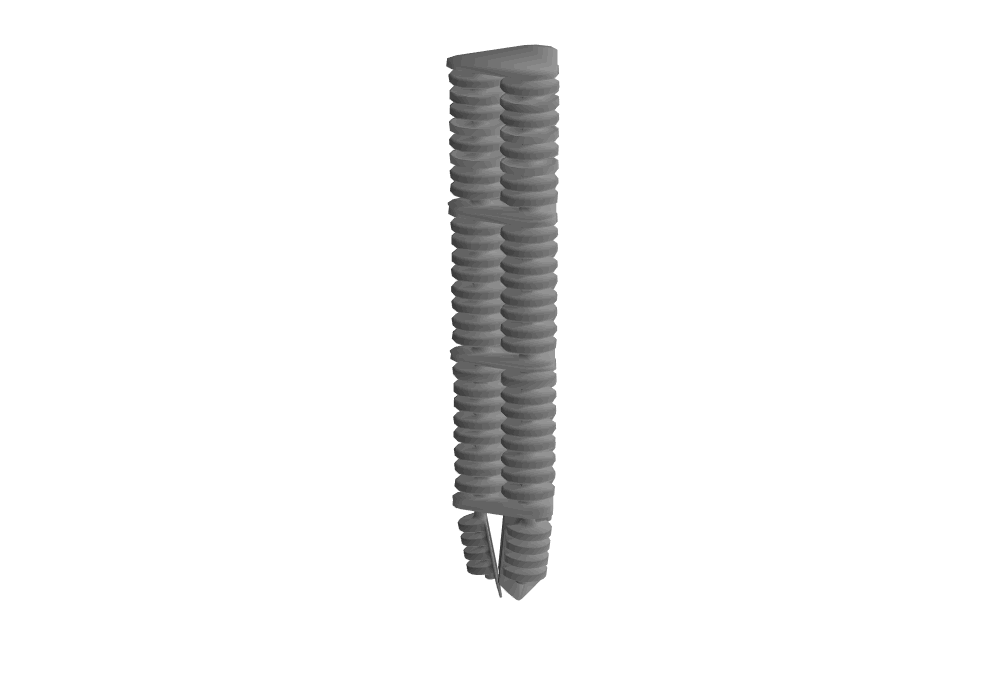
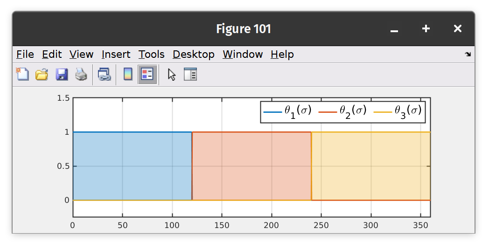

<script>
MathJax = {
  tex: {
    inlineMath: [['$', '$'], ['\\(', '\\)']]
  },
  svg: {
    fontCache: 'global'
  }
};
</script>
<script type="text/javascript" id="MathJax-script" async
  src="https://cdn.jsdelivr.net/npm/mathjax@3/es5/tex-svg.js">
</script>

#  Simulating the dynamics of a multi-link soft robot manipulator (PCC approach)
{: .no_toc }

<details open markdown="block">
  <summary>
    Table of contents
  </summary>
  {: .text-delta }
1. TOC
{:toc}
</details>
---

#### Difficulty: `intermediate`{: .fs-3 .text-green-200}
{: .no_toc }
 - Required classes: `Shapes.m`{: .text-purple-000}, `Model.m`{: .text-purple-000}, `Rig.m`{: .text-purple-000}
 - Code length: `~25 lines`{: .text-purple-000} (without comments)

---

### Introduction
In the following example, we will build a multi-link soft robot manipulator, similar to Festo's Bionic Handling Assistant as shown below. The system consists of three pneumatic segments, which we will model according the *Piecewise-Constant-Curvature* description -- PCC in short. SOROTOKI comes equipped with two Classes: `Shapes.m`{: .text-purple-000} and `Model.m`{: .text-purple-000} which take care of the spatial strain parameterization and the continuum dynamic model, respectively. Furthermore, `Shapes.m`{: .text-purple-000} will also contain the physical properties of the spatial beam, such as density, stiffness, and damping coefficients. Once the dynamic trajectories of the system are solved using `Model.m`{: .text-purple-000}, we can call `Rig.m`{: .text-purple-000} to assign an kinematic rig for 3D-graphical models. The resulting simulations is produced using SOROTOKI:

<div align="center">
 </div>
<div align="center">
Festo's Bionic Handling Assistant inspired by the elphant's trunk (see [1])  
</div>

<div align="center">
 </div>
<div align="center">
Three-link soft robot manipulator dynamics using SOROTOKI based on the Festo's Bionic Handling Assistant. The model's state dimension is $\dim(q) = 6$ that is two unique $x-z$ and $y-z$ curvatures per soft-link segment. 
</div>


### Strain parameterization
To describe the spatial evolution of the soft robot, we use the class `Shapes.m`{: .text-purple-000}. The input for the class is a matrix $Y$ of size $N \times M$, where $N$ is the number of spatial discretizations (i.e., the number of nodes along the spatial curve) and $M$ the number of unique modes. Note that the columns of $Y$ correspond to the spatial modes of the soft robotic model.

```matlab
%% spatial parameterization
L = 360;  % intrinsic length of soft robot
N = 300;  % number of spatial nodes

% construct spatial parameters X
X = linspace(0,L,N)';
Y = [];

% constructing the shape function matrix evaluated for X
for ii = 1:M
   Y(:,ii) = pcc(X/L,ii,M); % PCC 
end

% generate Shapes class
shp = Shapes(Y,Modes,'L0',L); % construct shape class
shp.show();                   % displays the columns of Y
```

The code above should produce the following:

<div align="center">  </div> 
<div align="center"> Shape functions of the three-link soft robot -- a three segmented piecewise constant strain. </div>

**Note:** By default, inputting an matrix into `Shapes`{: .text-purple-000} will ensure each column is mutually orthogonal using the Gram-Schmidt orthogonalization procedure, see [[2]](https://en.wikipedia.org/wiki/Gram%E2%80%93Schmidt_process). In other words, the integral $\int_0^L Y_i^\top Y_j \; d\sigma $ will be $1$ for indices $i = j$, and $0$ otherwise. Naturally, this ensure the spatial modes are decoupled from a compliance perspective.

**Note:** Second, notice we specify `Shapes(...,'L0',L)`{: .text-purple-000}. This ensure the intrinsic length of the curve is equal to $L$. By default, the intrinsic length is set to $L = 1$ if not adjusted by the user.

## Material assignment
Analogous to the finite element class, we can assign materials using `Shapes.Material`{: .text-purple-000}. Here, let us consider a Neo-Hookean material with Young's modulus $E = 10$ MPa and poisson ratio $\nu = 0.4$. We also change the density to $\rho = 150 $ kg/m$^3$ which translates to `Shapes.Material.Rho = 150e-12`{: .text-purple-000} as SOROTOKI uses unit millimeters (mm). After those assignments, we set the gravitational component using `Shapes.Gvec`{: .text-purple-000}. Once all physical properties are set, make sure to rebuild the necessary material tensors using `shp.rebuild()`{: .text-purple-000}.

```matlab
%% setting Neo-Hookean material
shp.Material = NeoHookeanMaterial(10,0.4);

% overwriting properties
shp.Material.Rho = 150e-12;    % setting density
shp.Gravity = [-9.81e3; 0; 0]; % setting gravity

% rebuild material tensors
shp = shp.rebuild();
```

## Constructing the Model class
Once the shapes and the physical parameters of the curve are set, we can construct the model class. To do so, we simply input the `shp` into `Model.m`. We also have to specify which Degrees-of-freedom we want to have enabled for the curve. Consider the vector `Modes = [kxx,kxz,kyz,exx,exz,eyz]` where `[kxx,kxz,kyz]` are the twist and curvatures modes, and `[exx,exz,eyz]` the elongation and shear modes. Since we consider a system undergoing pure bending specified by three PCC functions, we have `Modes = [0,kxz,kyz,0,0,0]` with `kxz = kyz = 3`.

```matlab
% generating Model class
Modes = [0,3,3,0,0,0]   % DOFs of the curve, i.e., only pure bending
mdl = Model(shp,Modes); % model class
```

**Important!** Note that the number of modes per DOF must corresponds to the number of columns of the matrix $Y$. let it be clear that the curvatures `kxy` and `kyz` do not have to share the same spatial description `Y`, as such, we can enrich the `Shapes` class by `shp = Shapes([Y1,Y2])` where `Y1` and `Y2` correspond to the spatial modes related to the curvatures `kxy` and `kyz`, respectively.

## Assigning a controller
The advantage of SOROTOKI is its own ODE solver that allows for easy controller development. To be more specific, the function which computes the generalized forces acting on the soft robot, given by `Model.tau`, can be overwritten by the user as to specify the torques a every timestep. For each function call, the solver will the class itself into `Model.tau`. Let us clarify why this is important, by considering the following example:

Suppose we want to develop an PD+ controller, that is, a Proportional-Derivative controller that compensates gravity and stiffness. Such a (model-based) controller has the following structure:

$$\tau = \nabla_{q}\;\mathcal{U}(q) - K_p e - K_d \dot{e} $$

[**[1]**](https://www.festo.com/group/en/cms/10241.htm) **Bionic Handling Assistant** a soft robotic manipulator from Festo.
{: .fs-3} 

[**[2]**](https://en.wikipedia.org/wiki/Gram%E2%80%93Schmidt_process) **Gram-Schmidt process** on constructing a orthonormal basis.
{: .fs-3} 

