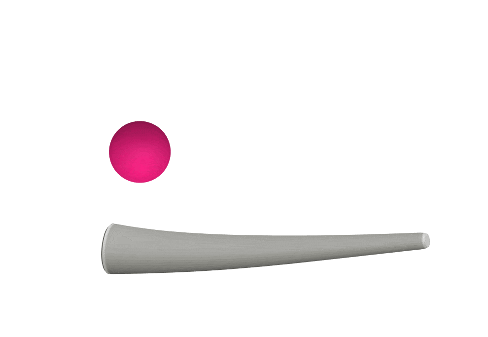
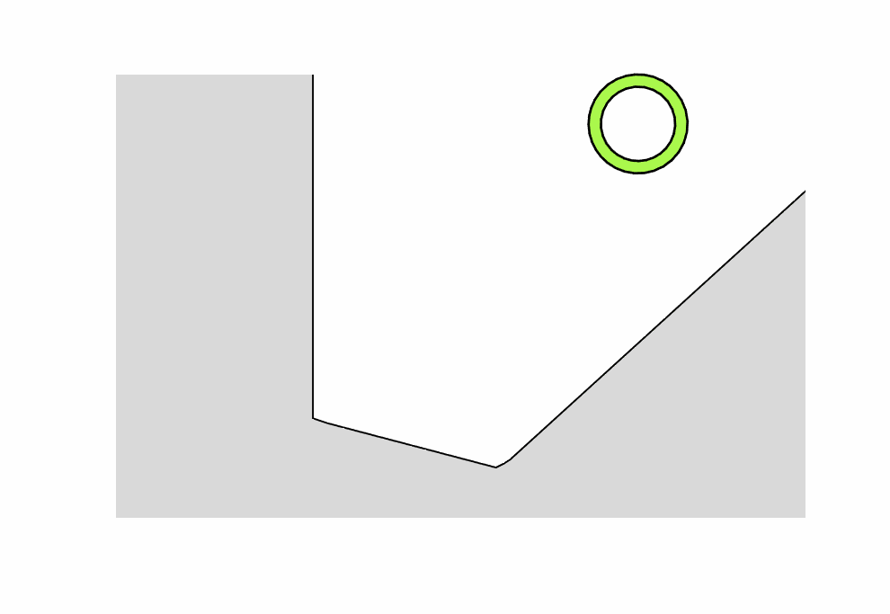
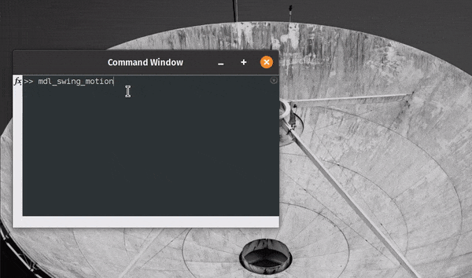

## News highlights
- **Jul 22, 2022**: We have significantly improved the performance of the dynamic fem solver and recently added contact friction. Resulting, we can simulate crawling for robots! See the example here below, inspired by the Multi-gait crawling soft robot by R. Shepherd et al. (2012) [10.1073/pnas.1116564108](https://doi.org/10.1073/pnas.1116564108)

  

<a href="https://github.com/BJCaasenbrood/SorotokiCode/blob/master/scripts/fem/2D/dynamic/fem_crawler.m"> Code available here</a>

- **Apr 05, 2022**: We have written a simulation environment of a continuum soft arm grabbing a spherical object described as Signed Distance Function `Sdf.m`{: .text-purple-000}. To make the soft arm envelop the object, we developed an energy-shaping technique that ensures the geometric distance between the robot and the object is minimal. In theory, this technique can be used to grab any arbitrarily shaped object as long as we describe it as a Sdf.

  

{: .text-purple-000}
**DISCLAIMER**: The soft arm still penetrates the object, no contact is prescribed in the simulation here. This will be implemented in the future!
{: .fs-2}

<a href="https://github.com/BJCaasenbrood/SorotokiCode/blob/master/scripts/mdl/mdl_swing_motion.m"> Code available here</a>

- **Apr 03, 2022**: We added environmental contact in SOROTOKI! You can now use Signed Distance Functions `Sdf.m`{: .text-purple-000} with `Fem.m`{: .text-purple-000}. Use `fem.AddConstraint('Contact',sdf,Move)`{: .text-purple-000} to add the contact. The vector `Move = [dX, dY]`{: .text-purple-000} or `Move = [dX, dY, dZ]`{: .text-purple-000} can be used to offset the contact. The contact dynamics can be solved Quasi-static or Dynamic.

  

- **Mar 10, 2022**: We hugely improved the dynamic simulations performance using a combination of Matrix-Differential Equations (MDEs) and Matlab's mex compiler. To enable the compiled dynamic solver, set `mdl.MexSolver = true`{: .text-purple-000} (default option). As an example, see `mdl_swing_motion`{: .text-purple-000}. It runs a 16-dim Kirchoff beam at 60 Hz easily! (5s simulation = 1s real-time).
Specs: Lenovo Yoga, AMD Ryzen 7 5800H, 32GB RAM.

  

<a href="https://github.com/BJCaasenbrood/SorotokiCode/blob/master/scripts/mdl/mdl_swing_motion.m"> Code available here</a>

- **Nov 11, 2021**: We recently added the functionality to perform real-time control of
soft robotic systems using a desktop-sized development platform, see [Github repo](https://github.com/chukhanhhoang/SoftRoboticSetupFesto). Using `Model.m`{: .text-purple-000}, we developed a model-based controller which we see in action below!

  

{: .text-purple-000}
**REMARK**: The controller shown in the video is not a 'elementary' PID controller, we actively use gravity compensation, and hyper-elastic and visco-elastic material compensation! To envelop these entities in a dynamic model, we used the SOROTOKI toolkit.
{: .fs-2}

{: .text-purple-000}
**REMARK**: All images below are produced using only MATLAB and the SOROTOKI toolkit, no additional software was used!
{: .fs-2}
