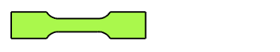
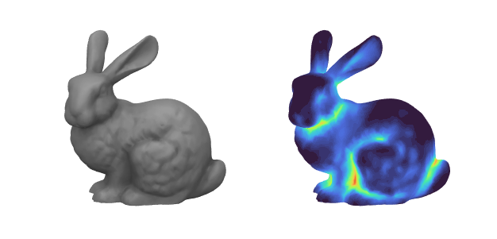

<!--
  https://fontawesome.com/how-to-use/on-the-web/styling/sizing-icons
-->

<!-- <script src="https://cdn.mathjax.org/mathjax/latest/MathJax.js?config=TeX-AMS-MML_HTMLorMML" type="text/javascript"></script> -->

<div align="center">  </div> <br/>

# **SOROTOKI** - An open-source soft robotics toolkit for MATLAB
{: .fs-6 .text-purple-000}

*SOROTOKI* is an open-source MATLAB toolkit for soft robotics that includes an array of tools for design, modeling, and control. Due to its scientific diversity, it can be challenging for new researchers to quickly familiarize themselves with multiple scientific areas. With the aim to lower this threshold, Sorotoki aims to incorporate multiple layers of soft robotics research into one compact toolkit. Examples include: continuum mechanics, dynamic systems and control theory, topology optimization, computer graphics, and much more to come! The combination provides a highly flexible programming environment and will hopefully aid the development of novel soft robotic research.

[Stable V2.05.19  (.zip)](https://github.com/BJCaasenbrood/SorotokiCode/zipball/master){: .btn .btn-purple .fs-5 .mb-4 .mb-md-0 .mr-2} [Stable V2.05.19 (.tar)](https://github.com/BJCaasenbrood/SorotokiCode/tarball/master){: .btn .btn-purple .fs-5 .mb-4 .mb-md-0 .mr-2} [View on Github](https://github.com/BJCaasenbrood/SorotokiCode){: .btn .fs-5 .mb-4 .mb-md-0}  
# How to install
{: .fs-5 .text-purple-000}
For the full install guide, please see check: [Documentation/Installation guide](./docs/documentation/install.html). Download the latest version from above, or clone the following repo using the following command:

```bash
git clone --depth 1  https://github.com/BJCaasenbrood/SorotokiCode.git
```

Once unpacked, navigate to the SOROTOKI directory, and run `sorotoki.m` in the command prompt to start the installation. Please be aware, the toolkit requires other Matlab packages to work appropriately. 

## Applications highlights
{: .text-purple-000}
SOROTOKI is exclusively developed as a multi-physics programming tools for the **design**, **modeling**, and **control** of soft robots. Below we see a diagram of how each of the six Matlab classes interact:
<div align="center">  </div>

- Implicit modeling with Signed Distance Functions (SDFs),
- Finite element method (FEM) using hyper-elastic materials,
- Topology optimization of (pressure-driven) soft robots,
- Dynamical modeling through differential geometric theory,
- (NEW!) Real-time control of soft robots via Raspi-interface,
- Fast graphics rendering with responsive textures.

### Signed Distance Functions and Meshing -- `Sdf.m`{: .text-purple-000}, `Mesh.m`{: .text-purple-000}

#### SDF: Implicit modeling of 2D-primes: union and subtraction
{: .text-purple-000}
<details>
<summary>Show image</summary>
<div align="left">  </div>

<a href="https://github.com/BJCaasenbrood/SorotokiCode/blob/master/scripts/mesh/mesh_sdf.m">Code available here</a>
</details>

#### SDF: Implicit modeling of 3D-primes: subtraction and intersection
{: .text-purple-000}
<details>
<summary>Show image</summary>
<div align="left">  </div>

<a href="https://github.com/BJCaasenbrood/SorotokiCode/blob/master/scripts/gmdl/SDF/preview_sdf.m">Code available here</a>
</details>

#### MESH: Signed distance function (SDF) to mesh
{: .text-purple-000}
<details>
<summary>Show image</summary>
<div align="left">  </div>
</details>

#### MESH: Polygonal meshing of circular SDF
{: .text-purple-000}
<details>
<summary>Show image</summary>
<div align="left">  </div>
</details>

### Finite Element Method  -- `Fem.m`{: .text-purple-000}

#### FEM: Uni-axial tensile test
{: .text-purple-000}

<details>
<summary>Show image</summary>
<div align="left">  </div>

<a href="https://github.com/BJCaasenbrood/SorotokiCode/blob/master/scripts/fem/2D/static/fem_tbone.m">Code available here</a>
</details>

#### FEM: Topology optimization of PneuNet actuator
{: .text-purple-000}

<details>
<summary>Show image</summary>
<div align="left">  </div>

<a href="https://github.com/BJCaasenbrood/SorotokiCode/blob/master/scripts/fem/2D/static/fem_tbone.m">Code available here</a>
</details>

#### FEM: Deforming PneuNet actuator -- Ecoflex 0030
{: .text-purple-000}

<details>
<summary>Show image</summary>
<div align="left">  </div>
</details>

#### FEM: 3D buckling of hyper-elastic beam
{: .text-purple-000}

<details>
<summary>Show image</summary>
<div align="left">  </div>
</details>

#### FEM: Hyper-elastic bouncing ball
{: .text-purple-000}

<details>
<summary>Show image</summary>
<div align="left">  </div>
</details>

#### FEM: PneuNet with dynamic contact
{: .text-purple-000}

<details>
<summary>Show image</summary>
<div align="left">  </div>
</details>


### Dynamic Model  -- `Model.m`{: .text-purple-000}

#### MODEL: Simulation of two-link soft robot
{: .text-purple-000}

<details>
<summary>Show image</summary>
<div align="left">  </div>
</details>

#### MODEL: Energy-based control of planar soft robot
{: .text-purple-000}

<details>
<summary>Show image</summary>
<div align="left">  </div>
</details>

#### MODEL: Basis reconstruction from FEM-data -- Reduced-order modeling
{: .text-purple-000}

<details>
<summary>Show image</summary>
<div align="left">  </div>
</details>

### Real-time Control -- `Control.m`{: .text-purple-000}

#### CONTROL: Closed-loop control of PneuNet actuator
{: .text-purple-000}
<details>
<summary>Show image</summary>
<div align="left">  </div>
</details>

#### CONTROL: Energy-based control two-link system
{: .text-purple-000}
<details>
<summary>Show image</summary>
<div align="left">  </div>
</details>

### Graphics Model -- `Gmodel.m`{: .text-purple-000}

#### GMODEL: Responsive rendering of the Stanford bunny
{: .text-purple-000}

<details>
<summary>Show image</summary>
<div align="left">  </div>
</details>

#### GMODEL: Responsive lighting
{: .text-purple-000}

<details>
<summary>Show image</summary>
<div align="left">  </div>
</details>

#### GMODEL: Rendering ambient occlusion (AO)
{: .text-purple-000}

<details>
<summary>Show image</summary>
<div align="left">  </div>
</details>

#### GMODEL: Rendering sub-surface scattering (SSS)
{: .text-purple-000}

<details>
<summary>Show image</summary>
<div align="left">  </div>
</details>

## Citation
{: .text-purple-000}

If you are planning on using Sorotoki in your (academic) work, please consider citing the toolkit  

```bibtex
@misc{Caasenbrood2018,
  author = {Caasenbrood, Brandon},
  title = {Sorotoki - A Soft Robotics Toolkit for MATLAB},
  year = {2020},
  publisher = {GitHub},
  journal = {GitHub repository},
  howpublished = {\url{https://github.com/BJCaasenbrood/SorotokiCode}},
}
```
